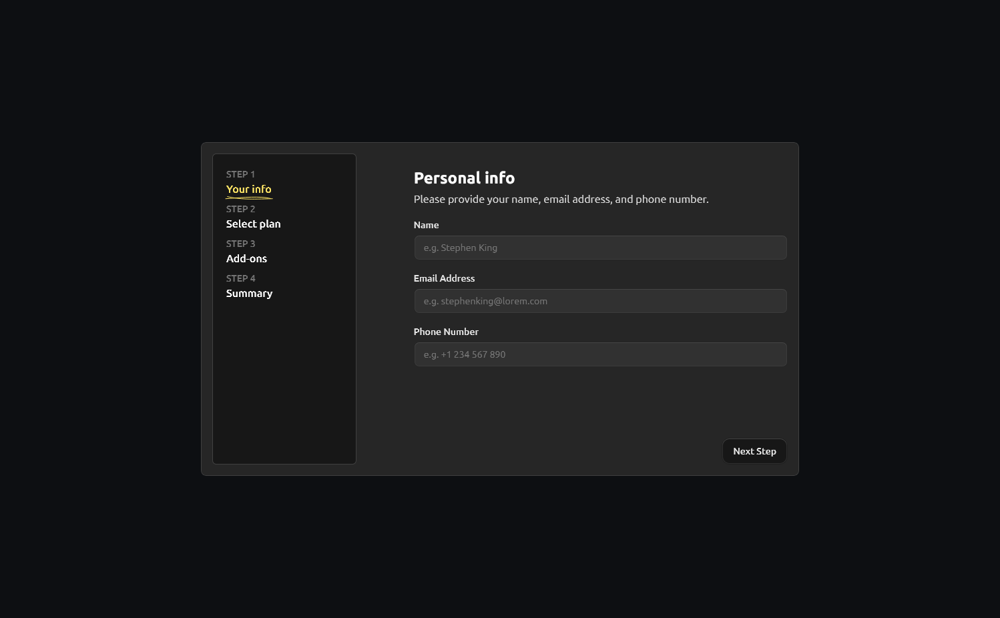

# Multi-step form

## Table of contents

- [Overview](#overview)
  - [Screenshot](#screenshot)
  - [Built with](#built-with)
  - [The challenge](#the-challenge)
  - [Links](#links)

- [Author](#author)
- [Acknowledgments](#acknowledgments)

## Overview

### Screenshot

### Built with

- Semantic HTML5 markup
- Flexbox
- Mobile-first workflow
- [React](https://reactjs.org/) - JS library
- [Next.js 13](https://beta.nextjs.org/docs) - React framework
- [TailwindCSS](https://tailwindcss.com/) - For styles
- [shadcn/ui](https://ui.shadcn.com/) - shadcn/ui components :rocket:
- [Framer Motion](https://www.framer.com/motion/) - For animations

### The challenge

Users should be able to:

- Complete each step of the sequence
- See a summary of their selections on the final step and confirm their order
- View the optimal layout for the interface depending on their device's screen size
- See hover and focus states for all interactive elements on the page

### Links

- Live Site URL: [Here](https://multi-step-form-tawny.vercel.app/)

## Author

- Website - [Marcos V Fitzsimons](https://marcosfitzsimons.com.ar/)
